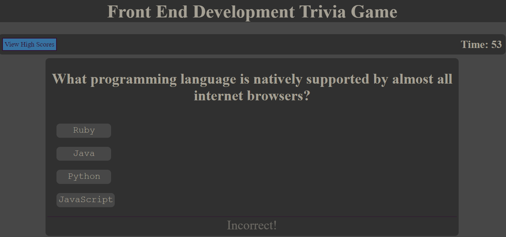
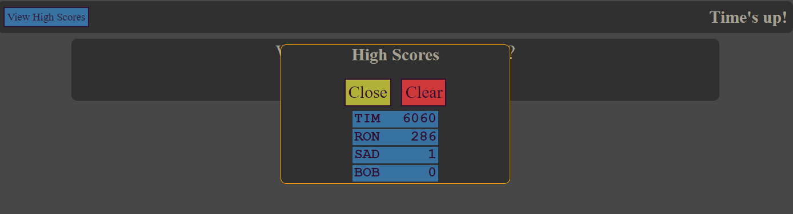

## User Story

```
AS A coding boot camp student
I WANT to take a timed quiz on JavaScript fundamentals that stores high scores
SO THAT I can gauge my progress compared to my peers
```

## Acceptance Criteria

```
GIVEN I am taking a code quiz
WHEN I click the start button
THEN a timer starts and I am presented with a question
WHEN I answer a question
THEN I am presented with another question
WHEN I answer a question incorrectly
THEN time is subtracted from the clock
WHEN all questions are answered or the timer reaches 0
THEN the game is over
WHEN the game is over
THEN I can save my initials and my score
```
### To Use
```
Parameters about the quiz will be displayed in the sentences above the "Start Quiz" button.
To start the quiz, simply press the "Start Quiz" button.
```

```
You will then be presented with a multiple choice question with buttons corresponding to possible answers.
While the questions will be presented in the same order every time, the order of the answers will be pseudo-randomized.
Click on the button of the answer that you think is correct.
When you pick an answer, you will be notified if your choice was correct or incorrect and the quiz will move on to the next question.
If your answer was correct, you will earn more points. If it was incorrect, you will earn less points. Additionally, you will lose time on the timer.
If you run out of time, either through time elapsing or through penalty, the quiz will end.
If you answer all of the questions, the quiz will end.
```

```
When the quiz ends, you will be presented with a "Game Over!" screen, on which you can enter in and submit your initials.
The initials field only allows, and requires, 3 alphanumeric characters.
Clicking on the "Submit" button with less than 3 characters entered will cause an error to appear for a short time.
```

```
After submitting your initials, the scores screen will appear.
On the scores screen, you will see a list of scores with the scorer's initials, sorted descendingly from the top score.
There are two buttons: Close and Clear. Close will close the scores screen. Clear will clear all the scores from the scores screen.
```

```
After submitting your initials and closing the scores screen, you will see a semi-final screen with two buttons.
The "Restart" button will restart the entire process from the start screen.
The "End" button will exit out of the quiz and display a final 'thank you' screen.
```

```
The View High Scores button at the top will toggle open/close the scores screen. You can do this before, during, or after the quiz. You can see it boxed in red in the image below.
The View High Scores button is available at any time before, during, or after the quiz, except after pressing the "End" button.
```


### Changing the Quiz

```
Within the assets/scripts/script.js file are a few variables at the top.
The first variable is "quizTime" and relates to the time (in seconds) the quiz will have as a duration.
The second variable is "penaltyAmount" and is how much of a penalty to the timer (in seconds) the user incurrs when answering incorrectly.
The final variable is an object array named "allQuestions", with each array item created via the "generateQuestions" function.
The objects in the array have 4 properties generated from 7 parameters given to "generateQuestions" function when it is called:
    question: "A question to be asked to the user"
    answers: ["A possible answer", "Another possible answer", "Yet another possible answer", "A final possible answer"]
    solution: "The real actual answer, which is identical to at least one of the array items in the answers property.
    multiple: true or false
Adding another item to the array with a generateQuestion() function call with the parameters will actually increase the number of questions the quiz gives the user, and that will be reflected on the start screen.
Actually calling the function within "allQuestions" is done by like so:
```

```
Make sure there is a comma between each call of generateQuestion() within the allQuestions array, but not after the last one.
In the example, you can see there is a comma at the end of the top line, but not on the bottom line. This is because the bottom line is the very last element in the array.
```

## Resources

Github repository: https://github.com/tperschon/webdevquiz/

Live site: https://tperschon.github.io/webdevquiz/
